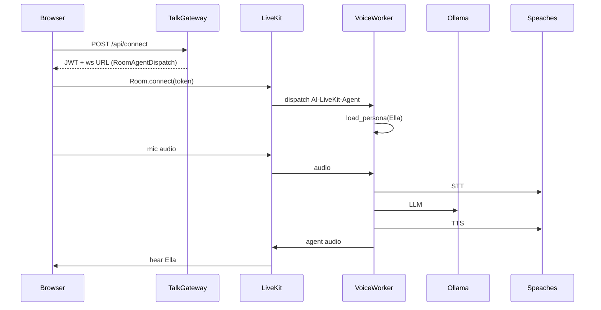
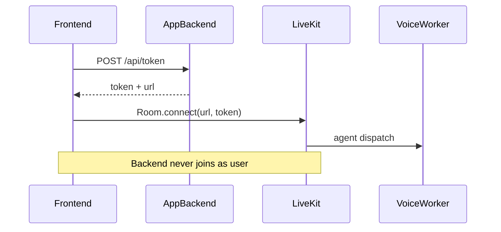
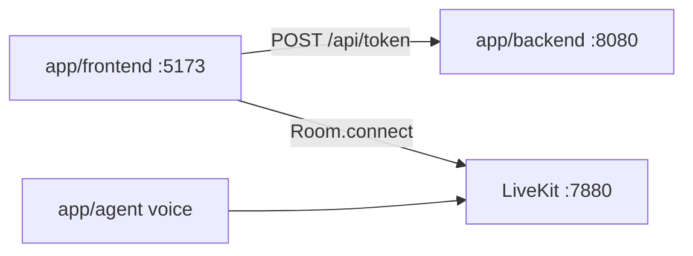
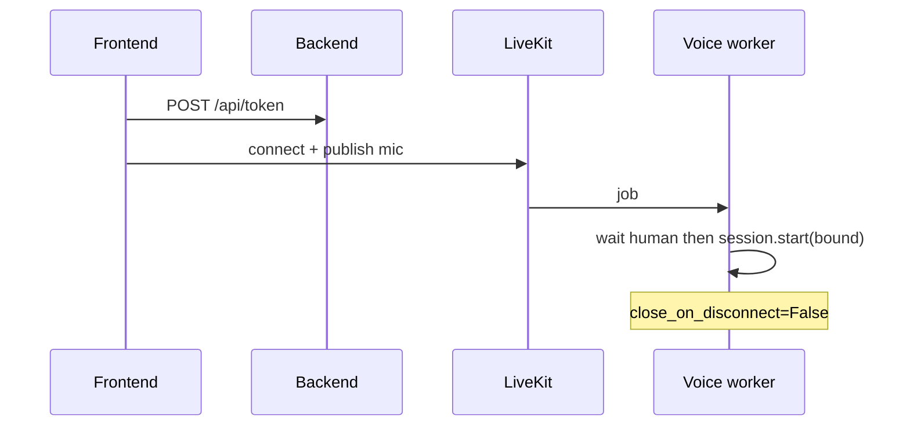
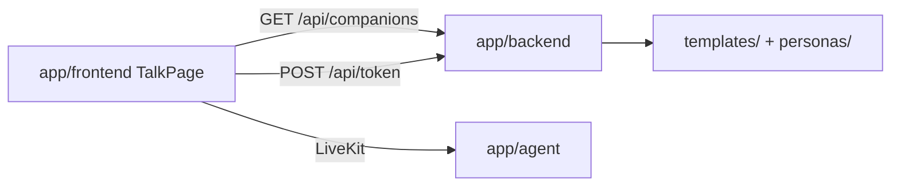
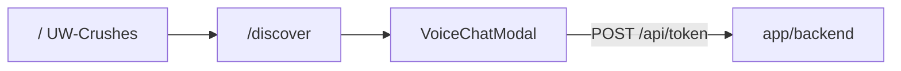
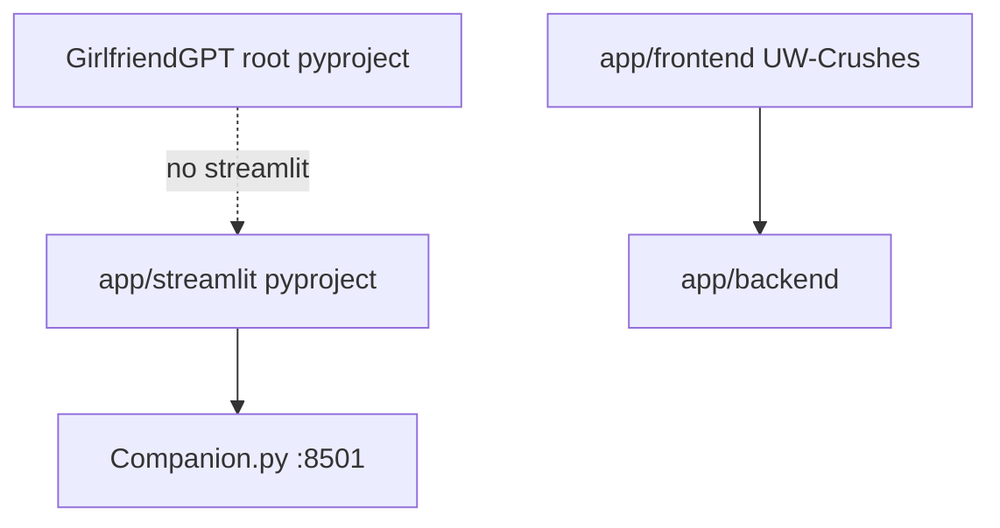
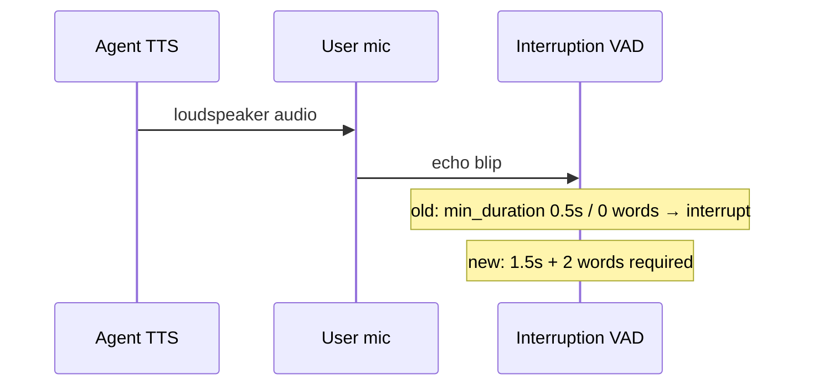
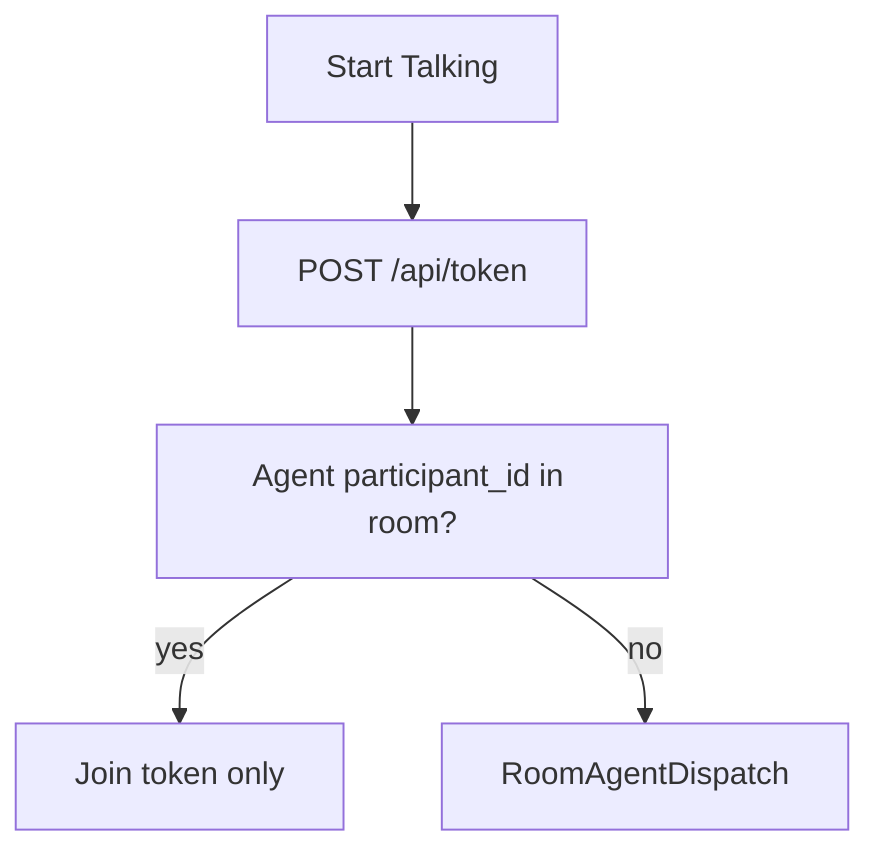

# Cursor Engineering Log — 2026-07-21

## Session: 19:15 - Local AI Girlfriend Talk Stack (standalone)

### Thought Process & Regression Analysis

- **Problem:** GirlfriendGPT needed a self-contained local path to talk to the AI girlfriend in a browser. ALI orchestration is gone; persona catalog symlinks to `ali-agents/GirlfriendGPT-agents` were broken; there was no Docker LiveKit or browser Talk UI in-package.
- **Regression Opportunities:** `agent_paths` / `load_persona` / worker name → Ella fallback; talk `/api/connect` JWT + RoomAgentDispatch metadata (`agent_id`, `greeting_context`).
- **Execution Strategy:** Tests executed via dedicated CI/CD Workflow `GirlfriendGPT Voice Agent Tests` (`.github/workflows/girlfriendgpt-voice-agent.yml`).

### UML Diagram

### Changes

- In-package `app/agent/personas/` (Ella, Nia) + `app/agent/tools/`
- `agent_paths.py` prefers package root; no ALI required
- `docker-compose.yml` + `livekit.yaml` (LiveKit + Redis + talk-gateway)
- `talk/` FastAPI gateway + browser Talk page
- Pytest + workflow for automated regression on the local branch / remote pipeline

Tests and workflow configured for automated execution on the local branch/remote pipeline.
**Workflow Name:** `GirlfriendGPT Voice Agent Tests` / job `pytest`

## Session: 19:20 - Frontend→Backend token, Frontend→LiveKit

### Thought Process & Regression Analysis

- **Problem:** Clarify traffic: backend must only mint tokens; the frontend is the LiveKit client.
- **Regression Opportunities:** `/api/token` response shape `{token, url}`; `/api/connect` alias; TalkPage + static UI follow two-step connect.
- **Execution Strategy:** Tests executed via dedicated CI/CD Workflow.

### UML Diagram

## Session: 19:25 - Token API owned by app/backend

### Thought Process & Regression Analysis

- **Problem:** User specified backend location is `app/backend`, not `app/agent/talk`.
- **Regression Opportunities:** `app/backend/tests/test_livekit_token.py`; compose `backend` service builds from `../backend`.
- **Execution Strategy:** Tests via workflow jobs `backend-token` + `agent`.

Canonical: Frontend → `app/backend` `/api/token` → Frontend → LiveKit.

## Session: 19:30 - Frontend owned by app/frontend

### Thought Process & Regression Analysis

- **Problem:** User specified frontend path is `app/frontend`.
- **Regression Opportunities:** Vite app default route = TalkPage; `/api` proxy to backend; compose `frontend` service (nginx → backend).
- **Execution Strategy:** `npm run build` in app/frontend; stack via agent docker compose.

## Session: 19:35 - Agent owned by app/agent

### Thought Process & Regression Analysis

- **Problem:** Lock the third package path: voice worker = `app/agent`.
- **Regression Opportunities:** `app/README.md` three-package table; `app/docker-compose.yml` is canonical stack; agent compose includes it.
- **Execution Strategy:** Document + compose include; worker still `uv run python voice_agent.py dev` from `app/agent`.

## Session: 20:00 - Live left/right transcripts

### Thought Process & Regression Analysis

- **Problem:** User wants realtime STT for both speakers — Ella left, user right.
- **Regression Opportunities:** `upsertTranscriptLine` / `resolveWhoFromMeta` in `app/frontend/src/transcript.ts`; agent `RoomOutputOptions(transcription_enabled=True)`.
- **Execution Strategy:** `npm test` in app/frontend; agent republishes `lk.transcription` streams.

## Session: 20:10 - Fix deaf agent (no hearing)

### Thought Process & Regression Analysis

- **Problem:** Lena greets (TTS works) but does not hear the user — no STT metrics. LiveKit showed user ICE reconnect loops (~15s) and sessions where the user mic never published; agent used `close_on_disconnect=True` and linked audio after `session.start`.
- **Regression Opportunities:** `voice_agent._first_human_participant` / wait-before-start; `RoomInputOptions(close_on_disconnect=False, participant_identity=…)`; frontend waits for agent join; backend explicit `CreateAgentDispatch`.
- **Execution Strategy:** Tests via `uv run pytest tests/test_patient_link.py` in `app/agent`.

## Session: 20:15 - Lena English + single greeting

### Thought Process & Regression Analysis

- **Problem:** Transcript showed Dutch-planned CoT (`# Response Selection`) twice instead of one English spoken greeting — Qwythos `generate_reply` leaked planning text; persona defaulted to Dutch.
- **Regression Opportunities:** `personas/Lena Van Der Meer.json` English TTS/greetings; `voice_agent` greets via `session.say(template)`; `tests/test_worker_name_persona.py`.
- **Execution Strategy:** `uv run pytest tests/test_worker_name_persona.py tests/test_patient_link.py` in `app/agent`.

## Session: 20:17 - Dedupe transcript bubbles

### Thought Process & Regression Analysis

- **Problem:** Identical YOU bubbles — TalkPage listened to both `lk.transcription` and `TranscriptionReceived`.
- **Regression Opportunities:** `upsertTranscriptLine` content dedupe; single text-stream listener in `TalkPage.tsx`; `transcript.test.ts`.
- **Execution Strategy:** `npm test` in `app/frontend`.

## Session: 20:40 - Fix intermittent silent agent audio

### Thought Process & Regression Analysis

- **Problem:** Agent TTS runs (metrics show audio) but browser sometimes plays no sound — autoplay gesture expires before remote track arrives.
- **Regression Opportunities:** `room.startAudio()` after connect + after agent join; `attachAllRemoteAudio`; Enable sound button; `AudioPlaybackStatusChanged`.
- **Execution Strategy:** Manual talk check on http://127.0.0.1:5173.

## Session: 20:46 - Agent chatwindow UI in Discover app

### Thought Process & Regression Analysis

- **Problem:** New app/frontend VoiceChatModal was a JWT debug panel; chatwindow had the real Lena talk UX.
- **Regression Opportunities:** `/talk-api` proxy; `useAgentTalkSession`; `VoiceChatModal` bubbles; `VoiceTalkContext` + AI profile TALK; `src/lib/transcript.test.ts`.
- **Execution Strategy:** `npm test` in `app/frontend`.

## Session: 21:00 - Default UI is Vite, not Streamlit

### Thought Process & Regression Analysis

- **Problem:** Mistakenly treated Streamlit (`src/ui`, :8501) as the "legacy/default" UI; user clarified default is Vite `app/frontend` (:5173).
- **Regression Opportunities:** Talk left bar via `GET /api/companions` (templates + personas); `TalkPage.tsx` character select; `tests/test_companions.py`; Streamlit demoted to optional script.
- **Execution Strategy:** Tests executed via dedicated CI/CD Workflow — `uv run pytest tests/test_companions.py` in `app/backend`.

## Session: 21:05 - Restore UW-Crushes as default UI

### Thought Process & Regression Analysis

- **Problem:** `/` had been redirected to Talk; user wants the old UW-Crushes Landing + Discover shell back.
- **Regression Opportunities:** `App.tsx` routes; `api.getProfiles` companion fallback; VoiceTalk `agentId`; VoiceChatModal remains talk surface inside Discover.
- **Execution Strategy:** Manual check http://127.0.0.1:5173/ → Landing → Discover.

## Session: 21:10 - Isolate Streamlit under app/streamlit

### Thought Process & Regression Analysis

- **Problem:** Streamlit lived in `src/ui` and was a root dependency though the product UI is Vite.
- **Regression Opportunities:** Move to `app/streamlit/` with own `pyproject.toml`; drop streamlit from root; `scripts/run_streamlit_ui.sh`.
- **Execution Strategy:** `cd app/streamlit && uv sync`; companions path resolves to repo root.

## Session: 21:15 - Talk fills main pane (not modal)

### Thought Process & Regression Analysis

- **Problem:** Voice talk was a centered modal overlay; user wants it full-screen in the non-sidebar main area.
- **Regression Opportunities:** `AuthenticatedLayout` swaps `Outlet` ↔ talk pane; `VoiceChatModal` is full-height main content.
- **Execution Strategy:** Manual: Discover → TALK → pane fills beside sidebar; X returns to Discover.

## Session: 21:28 - Fix mid-sentence TTS cutoffs

### Thought Process & Regression Analysis

- **Problem:** Agent audio stopped mid-sentence. Logs showed repeated `resumed false interrupted speech` — speaker→mic echo barged in; Speaches TTS often cannot pause/resume, so speech stayed cut.
- **Regression Opportunities:** `turn_handling_for_local_stack()` in `voice_agent.py`; `tests/test_turn_handling.py`; greeting `allow_interruptions=False`.
- **Execution Strategy:** Tests executed via dedicated CI/CD Workflow / local `uv run pytest tests/test_turn_handling.py`.

## Session: 21:35 - Persistent voice sessions + participant_id

### Thought Process & Regression Analysis

- **Problem:** End → Start always minted a new `talk-*` room and re-dispatched the agent.
- **Regression Opportunities:** `participant_id` on agent JSON; `voice_sessions.py` reuse/dispatch; 30m idle hard-end; FE `client_session_id`.
- **Execution Strategy:** Tests via `uv run pytest` in `app/agent` and `app/backend`.

