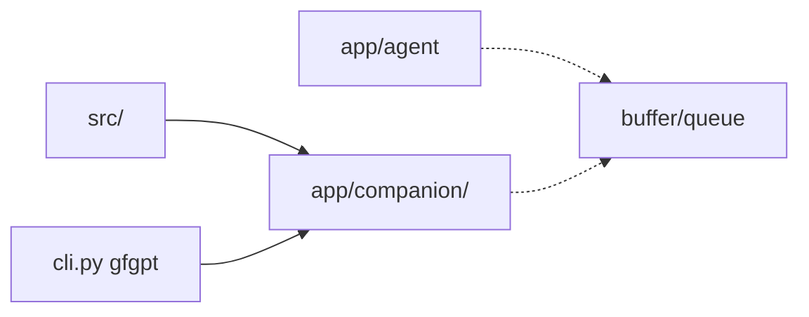

## Session: 10:06 - Move src → app/companion

### Thought Process & Regression Analysis

- **Problem:** Repo-root `src/` was the CLI companion stack with a vague name; belongs under `app/` next to agent/backend/frontend.
- **Regression Opportunities:** package rename `src`→`companion`; `config/manager.py`; `cli.py` PYTHONPATH; streamlit personalities path.
- **Execution Strategy:** Manual import smoke via `PYTHONPATH=app uv run python -c`.

## Session: 13:36 - Streamlit = chron + subagent only

- Removed Discover/Talk/Manage/Share from :8501.
- Home: Check-up chron tab + CLI sub-agent gateway tab.
- Product UI remains Vite :5173.

## Session: 14:08 - Remove all frontend sign-in

- Deleted AuthContext, ProtectedRoute, LoginPage, SignUpPage.
- App no longer wraps AuthProvider; MyProfile loads without user gate.
