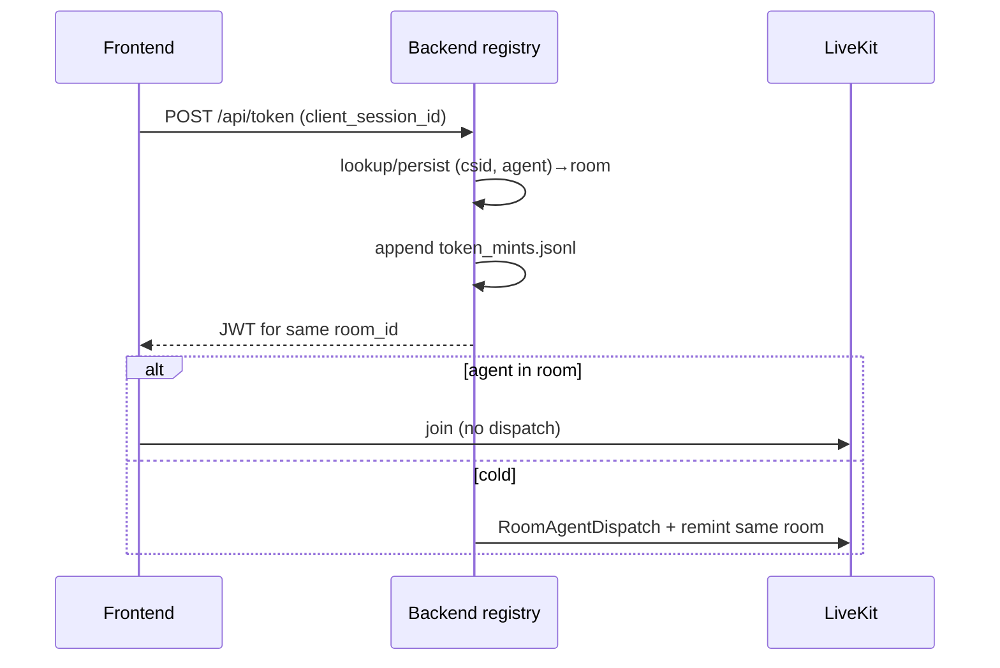

## Session: 13:11 - Short-term + durable caller memory

- (1) Soft LiveKit reuse keeps AgentSession chat (short-term).
- (2) `caller_memory` under ~/.gfgpt/voice_memory; inject into instructions on cold connect; `remember_about_user` tool writes notes.

## Session: 13:12 - Token remint → same room (no new room each connect)

### Thought Process & Regression Analysis
- Problem: each Connect must mint a fresh JWT (expiry) but must not invent a new LiveKit room.
- Regression: `voice_sessions.connect_voice_session`, `/api/token`, soft reuse when agent still present.
- Execution: tests via `uv run python -m unittest tests.test_voice_sessions`.

### UML Diagram

## Session: 13:17 - Rooms registry + mint expiry state

- Every mint logged: `token_id`, `room_id`, `issued_at`, `expires_at`, live `expiry_state` (active|expired).
- Rooms registry in `voice_sessions.json`; ledger `token_mints.jsonl`.
- APIs: `GET /api/rooms`, `GET /api/token-mints`, `GET /api/voice-sessions`.
- JWT body never stored — only id + expiry metadata.
